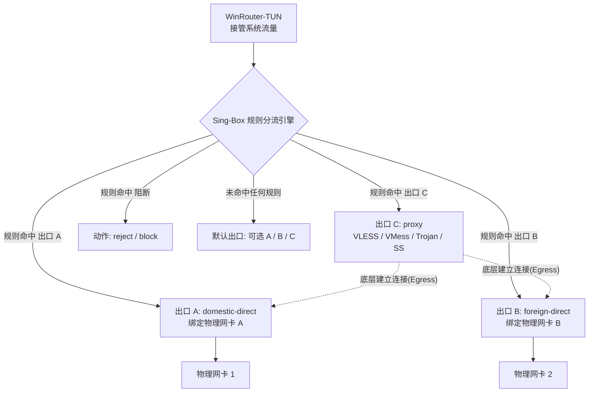

# WinRouter 虚拟出口 C 与统一多出口路由改造指南

本文档用于指导将 WinRouter 的代理功能抽象为**“虚拟出口 C（逻辑代理出站）”**，并将系统整体架构由原有的“模式分支切换（Direct-Split vs Proxy-Split）”重构升级为**“统一多出口策略路由（Multi-Egress Policy Routing）”**。

---

## 1. 架构愿景与设计理念

### 1.1 现状痛点
- **模式概念割裂**：目前系统存在 `direct-split` 与 `proxy-split` 两种全局模式，导致规则中的“最终出口（Final）”在不同模式下产生歧义。
- **用户心智负担重**：用户需要先决定全局模式，再思考规则。当希望“部分国外网站直连网卡 B，部分敏感网站走代理 C，国内网站走网卡 A”时，旧有的双模式设计难以直观表达。

### 1.2 统一多出口路由模型
将 WinRouter 抽象为拥有 **3 个标准出口 + 1 个动作** 的策略路由器：



* **出口 A（物理出口 A）**：绑定物理网卡 1（通常为国内宽带/默认物理网卡）。
* **出口 B（物理出口 B）**：绑定物理网卡 2（通常为直连海外专线/副网卡）。
* **出口 C（虚拟代理出口）**：逻辑代理出站（Active Proxy Node），底层连接根据节点配置锚定至网卡 A 或网卡 B。
* **默认出口（Default / Final）**：未命中任何显式规则时的最终去向，允许用户自由指定为 `A`、`B` 或 `C`。

---

## 2. 核心数据模型与配置变更

### 2.1 规则动作枚举扩展
自定义规则（Custom Rules）和 SRS 规则集（Rule Sets）的动作（`Action`）统一调整为：

| Action 值 | 描述 | 目标出站（Sing-Box Outbound） |
| :--- | :--- | :--- |
| `"a"` | 出口 A（直连网卡 A） | `domestic-direct` |
| `"b"` | 出口 B（直连网卡 B） | `foreign-direct` |
| `"c"` (或 `"proxy"`) | 出口 C（代理节点出站） | `proxy` |
| `"reject"` | 阻断丢弃 | `reject` (或 dns `reject`) |

### 2.2 默认出口（Default Outbound）
`MVPConfig` 中的 `default_outbound` 字段支持 `"a" | "b" | "c"`：
- 若设为 `"a"`，兜底流量走网卡 A；
- 若设为 `"b"`，兜底流量走网卡 B；
- 若设为 `"c"`，兜底流量走代理出口 C。

### 2.3 代理节点与 C 口定义
- 代理节点库中标记为 `Selected`（或当前活动）的节点即为 **出口 C 的实体**。
- 节点配置中的 `Egress: "a" | "b"` 指定了出口 C 在物理网卡上的底层隧道出口。
- 代理服务器自身 IP 必须自动注入底层出口的白名单（基础设施直连路由），严禁走 C 口自身以避免路由死循环。

---

## 3. 分阶段实施改造步骤

### 阶段一：内核配置生成层重构 (`internal/config` & `internal/policy`)

#### 1. 改造 `internal/config/mvp_model.go`
- 允许 `Action` 接受 `"c"`。
- 允许 `DefaultOutbound` 接受 `"c"`。
- 保留向后兼容：当解析旧配置时，若 `action == "final"` 且原模式为 `proxy-split`，平滑迁移为对应出口。

#### 2. 改造 `internal/config/mvp_generator.go`
- **出站列表构建**：
  - 始终生成 `local-direct`、`domestic-direct`（网卡 A）、`foreign-direct`（网卡 B）。
  - 若配置了有效代理节点，则生成 Tag 为 `proxy` 的 Outbound。
- **规则映射逻辑**：
  ```go
  switch custom.Action {
  case "a":
      mapped.Action, mapped.Outbound = "route", "domestic-direct"
  case "b":
      mapped.Action, mapped.Outbound = "route", "foreign-direct"
  case "c", "proxy":
      mapped.Action, mapped.Outbound = "route", "proxy"
  case "reject":
      mapped.Action = "reject"
  }
  ```
- **校验强化**：
  - 若用户规则中存在出口为 `c`，或默认出口设为 `c`，但未配置有效代理节点时，生成器需给出明确拦截提示（或按策略降级阻断/告警）。

---

### 阶段二：DNS 策略与出口 C 联动闭环

#### 1. 联动机制
域名分流不仅决定 TCP/UDP 连接走哪个出口，还决定 DNS 解析请求由谁执行：
- **命中出口 A**：DNS 查询分流至 `dns-domestic`（走网卡 A 解析，如国内 Public DNS 223.5.5.5）。
- **命中出口 B**：DNS 查询分流至 `dns-global`（走网卡 B 直连解析，如 8.8.8.8）。
- **命中出口 C**：
  - DNS 解析必须通过代理隧道查询，或使用 Fake-IP / 远端加密解析（如 `dns-proxy` detour 到 `proxy`）。
  - **核心价值**：彻底避免国内 DNS 污染，同时避免直连 DNS 解析出不优的 CDN 节点。

#### 2. Sing-Box DNS Servers 规划
```json
{
  "servers": [
    { "tag": "dns-domestic", "address": "223.5.5.5", "detour": "domestic-direct" },
    { "tag": "dns-global", "address": "8.8.8.8", "detour": "foreign-direct" },
    { "tag": "dns-proxy", "address": "tls://1.1.1.1", "detour": "proxy" }
  ]
}
```

---

### 阶段三：前端界面与交互体验升级 (`frontend/src`)

#### 1. 出口配置（网卡与代理页）
- **网卡设置**：清晰标注 **“出口 A (网卡 1)”** 与 **“出口 B (网卡 2)”** 的物理网卡绑定。
- **代理节点设置**：明确提示 **“当前选中的节点将作为 出口 C”**，并在节点编辑弹窗中直观配置“底层连接网卡（走出口 A / 走出口 B）”。

#### 2. 规则管理页（Custom Rules & Rule Sets）
- **动作下拉框统一**：
  - `[ 出口 A (网卡1直连) ]`
  - `[ 出口 B (网卡2直连) ]`
  - `[ 出口 C (代理出站) ]`
  - `[ 阻断 (Reject) ]`
- **默认出口（Default Route）**：
  - 提供单选/下拉选择：`出口 A` / `出口 B` / `出口 C`。

#### 3. 观测与连接监控页（Observability）
- 流量统计与连接监控列表，出站标签直接显示为清晰的 `出口 A`、`出口 B`、`出口 C`，方便用户排查规则命中情况。

---

## 4. 边界异常处理与安全防护

1. **防环保护（Loop Prevention）**：
   - 代理节点服务器的 IP 地址必须自动加入强规则（基础设施直连），强制绑定到节点配置指定的网卡（A 或 B），严禁进入 C 口。
2. **代理失效/未配置保护**：
   - 若用户指定了出口 C 的规则，但当前没有活动代理节点：
     - **严格策略**：阻断（Reject）命中 C 的流量并上报告警，避免敏感流量未经代理意外裸奔泄漏。
3. **IPv6 兼容契约**：
   - 当 IPv6 策略为 `block` 时，出口 C 同样不应处理 IPv6 流量。
   - 当 IPv6 策略为 `split` 且代理节点为 IPv6 地址时，确保底层出站正确使用 IPv6 路由。

---

## 5. 验收与测试计划

1. **配置生成测试**（`go test ./internal/config/...`）：
   - 测试规则动作指定为 `c` 时的 JSON 生成结果。
   - 测试默认出口为 `c` 时的 routing 与 dns 配置。
2. **端到端分流测试**：
   - 规则 A 命中目标（如 `*.baidu.com`） $\rightarrow$ 验证物理网卡 A 产生流量；
   - 规则 B 命中目标（如直连内网） $\rightarrow$ 验证物理网卡 B 产生流量；
   - 规则 C 命中目标（如 `*.google.com`） $\rightarrow$ 验证代理服务器产生封装流量，且客户端获取代理后 IP。
3. **UI 交互全流程验证**：
   - 添加/修改规则 $\rightarrow$ 选择出口 C $\rightarrow$ 应用并观测连接生效。
